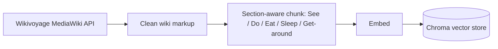
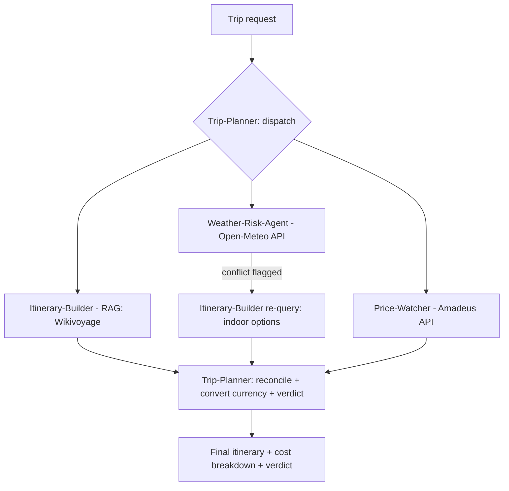
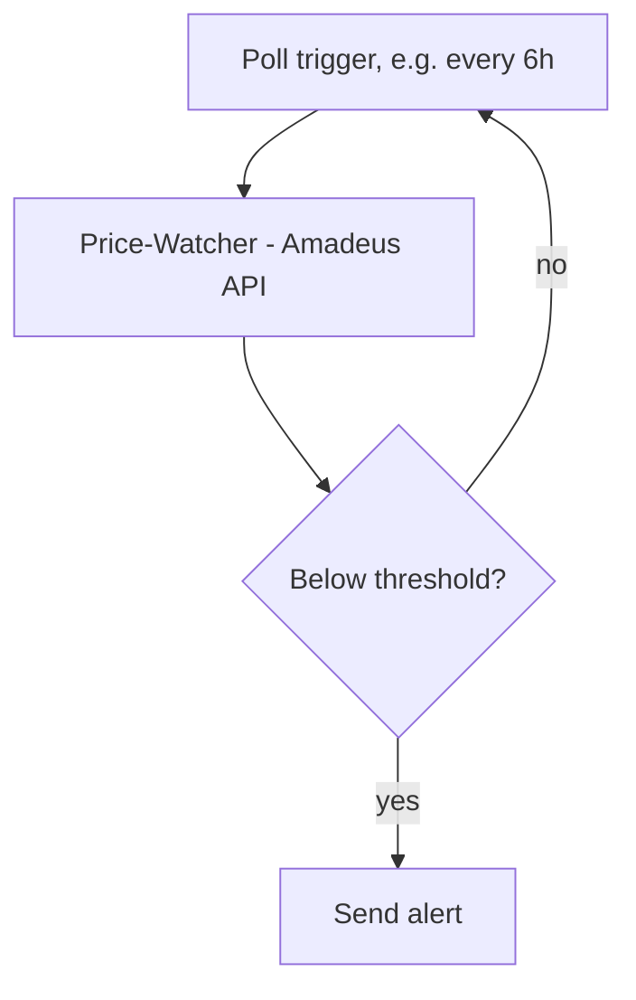

# TripRadar

A deep-agent proof of concept: grounded destination knowledge, live pricing, and weather-aware trip planning — built on RAG, LLM tool-calling, and an MCP tool layer, using only free data sources.

## Ingestion implementation

The knowledge pipeline is implemented at the parent project root under `src/tripradar_ingestion/`. Its configured destinations are Lisbon, Paris, London, and New York City. It uses Chroma for local MiniLM embeddings and persistent vector storage, with optional LangSmith tracing. See [README](../README.md) and [validation results](../docs/validation.md). The agents and live travel APIs described in this specification are subsequent work.

## Idea

TripRadar takes a trip request (destination, dates, budget) and returns a day-by-day itinerary grounded in real destination content, checked against live flight/hotel pricing, and flagged for weather conflicts — with a budget verdict at the end.

## Goal

Given a trip request, the system retrieves destination-specific guidance from a real open corpus, pulls live flight/hotel prices via API, checks weather risk for the travel dates, and produces a day-by-day itinerary with a budget breakdown — every recommendation traceable to either a retrieved guide passage or a live price/weather result.

**Success bar for the POC:** a coherent, budget-aware itinerary for 3–5 test destinations (starting with Lisbon) that a person could actually use.

---

## Use Cases

| # | Use Case | Trigger / Input | What Happens | Output |
|---|---|---|---|---|
| UC1 (MVP) | Budget Trip Planner | "Plan a 10-day trip to Portugal in October, budget $2,000" | Itinerary-Builder pulls destination content; Price-Watcher gets live flight/hotel cost; Weather-Risk checks the dates; Trip-Planner reconciles against $2,000 | Day-by-day itinerary + cost breakdown + fit/over-budget verdict |
| UC2 | Price-Drop Deal Hunter | "Watch Lisbon flights under $500 for any week in Nov" | Price-Watcher polls Amadeus on a schedule for the date range, compares against threshold | Alert only when a fare/hotel combo crosses the threshold |
| UC3 | Multi-Destination Comparison | "Portugal vs. Greece, same dates, same budget" | Runs the full UC1 pipeline twice in parallel, one per destination | Side-by-side table: cost, weather risk, itinerary highlights, recommendation |
| UC4 | Weather-Aware Itinerary Swap | Forecast shows rain on a day planned for an outdoor activity | Weather-Risk-Agent flags the conflict; Itinerary-Builder re-queries Wikivoyage's "Do" section filtered to indoor/weather-proof activities | Revised itinerary for that day with a note on why it changed |
| UC5 | Multi-Currency Budget Tracking | Trip spans countries with different currencies | Trip-Planner converts every cost component to the user's home currency before totaling | Single unified budget total |

UC1 is the MVP everything else builds on. UC2 is the differentiator — it's what makes this an ongoing "hunter" rather than a one-shot planner. UC3–5 are stretch goals.

---

## Data Sources

| Source | Purpose | What's Fetched | Access / License |
|---|---|---|---|
| **Wikivoyage** | RAG corpus — destination knowledge | Per destination: Get In, See, Do, Eat, Sleep, Get Around, Stay Safe sections | MediaWiki API, no key, CC-BY-SA |
| **Amadeus Self-Service (test tier)** | Live flight + hotel pricing | Flight Offers Search, Hotel Search, Flight Cheapest Date Search | Free dev account, no cost, no credit card for sandbox |
| **Open-Meteo** | Weather forecast/historical | Daily forecast (precip, temp, conditions) for a date range + location | No key, no signup |
| **Frankfurter.app** | Currency conversion | Daily ECB exchange rates | No key, no signup |

All sources are free. Amadeus is the only one requiring a (free) developer signup — everything else needs nothing beyond a URL.

---

## Agents

| Agent | Role | Input | Tool / MCP Server | Output |
|---|---|---|---|---|
| **Trip-Planner** | Parses the trip request, dispatches the other three agents (handles UC3's parallel fan-out), then reconciles their outputs against the budget — currency conversion, cost check, final verdict | Natural-language trip request | `currency` (Frankfurter) | Final itinerary + cost breakdown + verdict |
| **Itinerary-Builder** | Drafts the day-by-day plan from real destination content | Destination, trip length, interests | `destination-search` (Wikivoyage vector index) | Day-by-day activity list, cited to guide sections |
| **Price-Watcher** | Fetches live flight/hotel cost; polls repeatedly for UC2 | Origin, destination, dates | `flight-hotel-pricing` (Amadeus) | Current best fare/hotel combo, or a threshold-crossed alert |
| **Weather-Risk-Agent** | Flags date/activity conflicts with forecasted conditions | Destination, date range, planned outdoor activities | `weather` (Open-Meteo) | Flagged days + indoor-alternative trigger |

*Merged from an earlier 5-agent design: Orchestrator (no tool of its own) and Budget-Optimizer (pure synthesis of the other agents' outputs) were folded into one Trip-Planner agent that both dispatches and reconciles.*

### MCP Servers

- **`destination-search`** — wraps the Wikivoyage vector index, exposes `search_guide(destination, section, query)`
- **`flight-hotel-pricing`** — wraps Amadeus, exposes `search_flights(origin, dest, dates)` and `search_hotels(dest, dates)`
- **`weather`** — wraps Open-Meteo, exposes `get_forecast(location, date_range)`
- **`currency`** — wraps Frankfurter, exposes `convert(amount, from, to)`

Each MCP server maps 1:1 to a real external boundary — this is what makes the MCP layer load-bearing rather than decorative, and reusable on future projects.

---

## Architecture

### Offline — ingestion pipeline (runs once per destination)

### Online — per trip request

### UC2 (deal hunter) variant

Destination knowledge is embedded once and reused across requests; prices and weather are always fetched live, since those are exactly the facts that go stale.

---

## Complexity

| Component | Complexity | Why |
|---|---|---|
| Wikivoyage ingestion pipeline | Low | Free API, no auth, natural section boundaries make chunking easy |
| Weather + currency tool wrappers | Low | Zero-auth, single-endpoint REST calls |
| Amadeus flight/hotel wrapper | Low–Medium | Free but requires account setup + sandbox vs. production data quirks |
| Itinerary-Builder (RAG) | Low–Medium | Standard retrieval; main risk is relevance for less-documented destinations |
| Weather-Risk-Agent's activity-matching logic | Medium | Needs to map activity type (hiking vs. museum) to weather sensitivity |
| Trip-Planner: dispatch + fan-out (UC3) + budget trade-off logic | Medium–High | Multi-agent coordination, partial-failure handling (e.g., Amadeus timeout), and deciding what to cut when over budget is a real reasoning task |
| Price-Watcher polling loop (UC2) | Medium | Needs persistent state (last-seen price) and a scheduler |

**Overall: Low–Medium.** The ingestion pipeline and two of the four tools are easy wins; the real effort concentrates in the Trip-Planner's reconciliation/trade-off reasoning and the UC2 polling/alerting loop.

---

## Build Order

1. Wikivoyage ingestion: fetch pages for 10–15 destinations, section-aware chunk, embed, store
2. Wrap Open-Meteo + Frankfurter as MCP tools (zero-auth — good first MCP reps)
3. Sign up for Amadeus self-service (free), wrap flight/hotel search as an MCP tool
4. Trip-Planner + Itinerary-Builder: get one destination's RAG-based itinerary working end to end
5. Add Price-Watcher + Weather-Risk-Agent into the loop
6. Add Trip-Planner's budget reconciliation as the final synthesis/trade-off step
7. *(Stretch)* Polling loop for UC2 — re-check Amadeus prices on a schedule, alert on threshold
